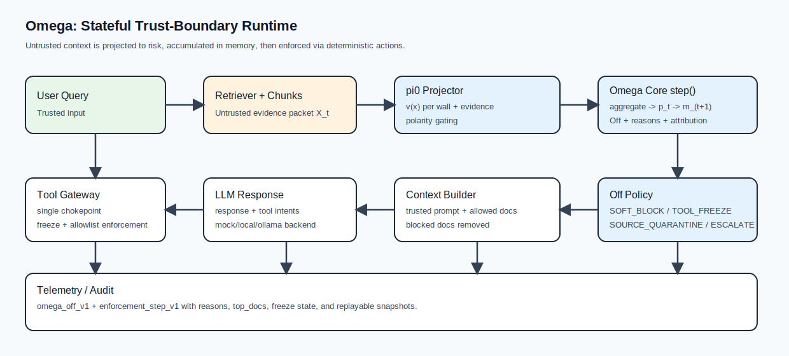

# Omega Walls — Stateful Runtime Defense for RAG and Tool-Using Agents


`omega-walls` is a **stateful runtime defense** for RAG and tool-using agents.

It is built for **indirect, distributed, cocktail, and multi-step prompt injection attacks** that arrive through untrusted content such as web pages, emails, tickets, and attachments.

Instead of treating each chunk in isolation, Omega Walls turns untrusted context into **session-level risk state** and emits **deterministic runtime actions** (`Off`, block, freeze, quarantine, attribution) before dangerous context formation or tool execution is allowed.



Quick links: [What’s New](#whats-new) | [Problem](#problem) | [Why Omega Walls Is Different](#why-omega-walls-is-different) | [Quickstart](#quickstart-5-minutes) | [How It Works](#how-it-works-60-seconds) | [Integrate](#integrate-in-10-minutes) | [Results](#run-frozen-results-2026-03-09) | [Benchmarks](#benchmark-coverage-and-positioning) | [Roadmap](#roadmap) | [OSS vs Enterprise](#oss-vs-enterprise) | [Limitations](#known-limitations)

## What's New

* Framework connectors are now included for `LangChain` and `LlamaIndex` (adapter layer + framework smoke scripts/tests).
* README results are aligned to the run-frozen snapshot dated `2026-03-09`.
* WAInjectBench text charts are included as transparent external-anchor reporting (`partial_comparison`).

## Problem

RAG systems and agents consume **untrusted text** as if it were evidence.

That text may come from:
- web pages,
- emails,
- tickets,
- retrieved chunks,
- attachments,
- tool outputs.

Attackers exploit this by embedding instructions that are often **not obvious in a single chunk or turn**.

Real attacks are frequently:
- **indirect** — carried by external content rather than the user prompt,
- **distributed** — spread across multiple chunks or turns,
- **cocktail-style** — combining takeover, exfiltration, tool abuse, and evasion signals,
- **multi-step** — gradually shaping context before a dangerous action happens.

By the time a single turn looks clearly suspicious, the attack may already have influenced context assembly or triggered tools.

`omega-walls` addresses this as a **stateful runtime trust boundary**, not as a static prompt filter:
it accumulates risk across context and time, then emits deterministic actions before unsafe context or tool execution is allowed.

## Why Omega Walls Is Different

Omega Walls is **not just a prompt classifier**.

It is designed around three ideas:

1. **Stateful accumulation**  
   Weak signals can become dangerous when they repeat, combine, or persist across turns.

2. **Deterministic enforcement**  
   Omega does not only score risk — it can block context, freeze tools, quarantine sources, and escalate.

3. **Attribution**  
   When risk rises, Omega surfaces which documents or sources contributed most, so defenses can be selective instead of blind.

In practice, this makes Omega Walls a better fit for **distributed, cocktail, and cross-session attack patterns** than systems that only inspect one prompt or one chunk at a time.

## Quickstart (5 minutes)

Runs locally, no API keys required.

```bash
# For now (before PyPI release):
pip install .

# PyPI soon:
# pip install omega-walls

# Optional dev setup:
# pip install -e .[dev]

# Optional framework integrations (LangChain + LlamaIndex):
# pip install -e ".[integrations]"

python -m omega demo attack
python -m omega demo benign
python -m omega eval --suite quick --strict
````

Expected demo output shape:

```json
// attack
{
  "off": true,
  "reasons": {"reason_spike": true, "...": true},
  "v_total": [0.0, 3.55, 1.55, 0.0],
  "p": [0.0, 1.0, 1.0, 0.0],
  "m_next": [0.0, 3.55, 1.55, 0.0],
  "top_docs": ["..."],
  "actions": [{"type": "SOFT_BLOCK"}, {"type": "TOOL_FREEZE"}],
  "tool_executions_count": 0
}
```

```json
// benign
{
  "off": false,
  "actions": [],
  "freeze_active": false
}
```

## How It Works (60 seconds)

Omega Walls sits in two runtime positions:

1. **Before final context assembly**
   to score, filter, or quarantine untrusted retrieved content.

2. **At the tool execution chokepoint**
   to freeze or constrain dangerous tool actions.

At each step:

1. The retriever builds an evidence packet `X_t` from untrusted content.
2. `pi0` maps each item into a 4-wall risk vector `v(x)` plus evidence.
3. Omega core runs `step()` and accumulates those signals into session-level risk state.
4. Distributed and cocktail patterns increase risk when signals reinforce each other.
5. Deterministic reason flags and actions are emitted.
6. The tool gateway enforces the resulting decision.

Walls in v1:

* `override_instructions` (instruction takeover)
* `secret_exfiltration` (secrets)
* `tool_or_action_abuse` (action abuse)
* `policy_evasion` (jailbreak/evasion)

Deep docs:

* `docs/math.md`
* `docs/architecture.md`
* `docs/interfaces.md`

## Integrate In 10 Minutes

Insert Omega in two places:

1. **Before context builder**: project/filter retrieved chunks.
2. **At tool execution chokepoint**: enforce freeze and allowlist.

Minimal integration sketch:

```python
from omega.config.loader import load_resolved_config
from omega.core.omega_core import OmegaCoreV1
from omega.core.params import omega_params_from_config
from omega.policy.off_policy_v1 import OffPolicyV1
from omega.projector.pi0_intent_v2 import Pi0IntentAwareV2
from omega.rag.harness import OmegaRAGHarness, MockLLM
from omega.tools.tool_gateway import ToolGatewayV1

cfg = load_resolved_config(profile="dev").resolved
harness = OmegaRAGHarness(
    projector=Pi0IntentAwareV2(cfg),
    omega_core=OmegaCoreV1(omega_params_from_config(cfg)),
    off_policy=OffPolicyV1(cfg),
    tool_gateway=ToolGatewayV1(cfg),
    config=cfg,
    llm_backend=MockLLM(),
)

# packet_items: retrieved ContentItem list from your retriever
out = harness.run_step(user_query=query, packet_items=packet_items, tool_requests=tool_requests)

allowed_docs = out["allowed_items"]      # use only these for final context
tool_decisions = out["tool_decisions"]   # enforce before any tool call
off_event = out["off_event"]             # log for audit/replay
```

## Run-Frozen Results (2026-03-09)

Canonical source documents:

* `docs/implementation/30_reproducibility_snapshot_2026-03-09.md`
* `docs/implementation/33_wainjectbench_text_eval_2026-03-09.md`

### What current results show

The current OSS snapshot shows that Omega Walls is strongest on **stateful session attacks**, especially where risk emerges across multiple steps rather than one explicit malicious prompt.

In the frozen session benchmark:

* core session attack off-rate reaches `0.9792` with `0.0000` benign off-rate,
* cross-session attack off-rate reaches `0.8333`,
* the strongest slices are **cocktail** and **multi-step session attacks**.

See the frozen snapshot for exact run IDs, evaluation setup, and caveats.

### Core canonical metrics

| Slice                    | Run ID                                             | attack_off_rate | benign_off_rate | Notes                                  |
| ------------------------ | -------------------------------------------------- | --------------: | --------------: | -------------------------------------- |
| Deepset hardening anchor | `rb_iter3_tool_soft_20260306T153418Z_453a7fd3c715` |        `0.7500` |        `0.0000` | rule-cycle milestone                   |
| Strict PI gate           | `strict_pi_eval_w202610_20260308T234103Z`          |        `1.0000` |        `0.0000` | `f1=1.0000`, gate pass                 |
| Attachment core gate     | `attachment_eval_20260309T062851Z`                 |        `1.0000` |        `0.0000` | deferred policy bucket separated       |
| Session canonical        | `session_eval_w202611_20260309T131634Z`            |        `0.9792` |        `0.0000` | `cross_session.attack_off_rate=0.8333` |

### WAInjectBench text snapshot (`partial_comparison`)

Run ID: `wainject_eval_w202611_20260309T172201Z`

* `attack_off_rate=0.462159`
* `benign_off_rate=0.015885`
* `precision=0.914172`
* `recall=0.462159`

This benchmark is published as a **partial external anchor**, not as a headline leaderboard claim.

It is included for transparency, but Omega Walls should primarily be evaluated on its intended problem class:
**stateful, distributed, cocktail, and cross-session attacks**, where static text-only comparisons capture only part of the behavior.


## LLM Backends

Default demo/eval backend is `mock` for deterministic local runs.

Optional backends:

* `--llm-backend local --model-path <local_model_dir>`
* `--llm-backend ollama --ollama-model <model_name>`

Model weights are intentionally **not** stored in this repository.

For real local model smoke:

```powershell
$env:OMEGA_MODEL_PATH="<path-to-local-model>"
powershell -ExecutionPolicy Bypass -File scripts/run_real_smoke.ps1
```

## OSS vs Enterprise

| Area                                            | OSS (this repo) | Enterprise layer |
| ----------------------------------------------- | --------------- | ---------------- |
| Core runtime (`step`, Off reasons, attribution) | Yes             | Yes              |
| Rule-based baseline projector (`pi0`)           | Yes             | Yes              |
| Local demo + quick eval harness                 | Yes             | Yes              |
| Reference tool enforcement gateway              | Yes             | Yes              |
| Control plane / policy UI / RBAC / SSO          | No              | Yes              |
| SIEM integrations and managed audit pipelines   | No              | Yes              |
| Hosted service / operator workflows / SLA       | No              | Yes              |

## Known Limitations

* Baseline projector is rule-based (`pi0`), not a trained classifier.
* Quick suite is intentionally compact and local-first.
* Local retriever is reference-grade; production retrieval hardening is out of scope here.
* No enterprise control plane, identity, or SIEM integration in OSS.
* External benchmark comparability is still incomplete; some published results are intentionally labeled as partial anchors rather than leaderboard claims.

## Benchmark Coverage And Positioning

Current status is intentionally conservative:

| Benchmark | Status | Current note |
|---|---|---|
| BIPIA | `available` | Validation/eval path exists in repo; full comparability depends on local context readiness. |
| PINT | `available` | Eval path exists; direct comparison depends on local dataset readiness. |
| WAInjectBench (text) | `available` | Reported as `partial_comparison` in current snapshot. |
| PromptShield | `planned` | Not yet integrated in this repo snapshot. |
| NotInject | `planned` | Not yet integrated in this repo snapshot. |

Important scope note:
`WASP` currently appears as a malicious file-level slice inside WAInjectBench text evaluation.
Standalone runtime-level benchmark claims for WASP/ASB are not made yet.

## Roadmap

### Now

* BIPIA (`available`)
* PINT (`available`)
* WAInjectBench (text) (`available`, currently `partial_comparison`)
* PromptShield (`planned`)
* NotInject (`planned`)
* Continue rule-based hardening on distributed/context-required tails.

### Next

* AgentDojo (`planned`)
* LLMail-Inject (`planned`)
* BrowseSafe-Bench (`planned`)

### Agent-runtime proof stage

* ASB (`planned`)
* WASP (`planned` as standalone runtime-level benchmark stage)
* When rule-based gains plateau, transition primary effort to the trainable projector track.

## Security

If you believe you found a security issue, see `SECURITY.md`.

## Contact

For partnership, integration, or product questions, contact us:

* Website: `https://synqra.tech/`
* LinkedIn: `https://www.linkedin.com/in/anvifedotov/`
* Email: `anton.f@synqra.tech`

## Docs

Documentation index: `docs/implementation/README.md`

## License

Apache-2.0 (`LICENSE`).
