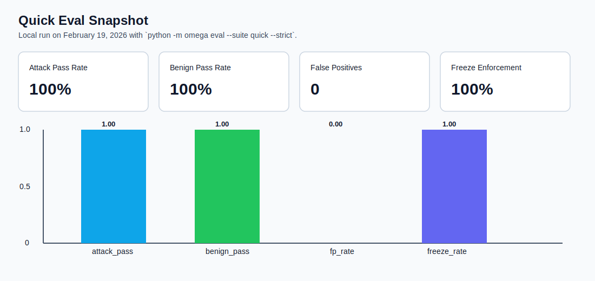

# omega-walls


`omega-walls` is a **stateful trust-boundary runtime** for RAG and agent systems.  
It turns untrusted retrieved content into risk state and deterministic actions (`Off`, block, freeze, attribution).


Quick links: [Problem](#problem) | [Quickstart](#quickstart-5-minutes) | [How It Works](#how-it-works-60-seconds) | [Integrate](#integrate-in-10-minutes) | [Eval](#eval-and-benchmark-snapshot) | [OSS vs Enterprise](#oss-vs-enterprise) | [Limitations](#known-limitations)

## Problem

RAG/agents read **untrusted** content (web pages, emails, tickets, attachments).  
Attackers inject instructions that can:

- override hierarchy and policies,
- force secret exfiltration patterns,
- trigger tool abuse and external actions,
- bypass text-only safeguards via distributed, multi-step payloads.

`omega-walls` addresses this as a runtime trust boundary, not a static prompt filter.

## Quickstart (5 minutes)

Runs locally, no API keys required.

```bash
# For now (before PyPI release):
pip install .

# PyPI soon:
# pip install omega-walls

# Optional dev setup:
# pip install -e .[dev]

python -m omega demo attack
python -m omega demo benign
python -m omega eval --suite quick --strict
```

Expected demo output shape:

```json
// attack
{
  "off": true,
  "reasons": {"reason_spike": true, "...": true},
  "v_total": [0.0, 3.55, 1.55, 0.0],
  "p": [0.0, 1.0, 1.0, 0.0],
  "m_next": [0.0, 3.55, 1.55, 0.0],
  "top_docs": ["..."],
  "actions": [{"type": "SOFT_BLOCK"}, {"type": "TOOL_FREEZE"}],
  "tool_executions_count": 0
}
```

```json
// benign
{
  "off": false,
  "actions": [],
  "freeze_active": false
}
```

## How It Works (60 seconds)

1. Retriever builds an evidence packet `X_t` from untrusted docs.
2. `pi0` projector maps each doc to a 4-wall risk vector `v(x)` + evidence.
3. Omega core runs `step()`.
4. `epsilon-floor -> aggregation -> phi -> optional cocktail effect -> deposit -> memory update (scar-mass)`.
5. Deterministic `Off` and reason flags are computed.
6. Off policy emits actions: `SOFT_BLOCK`, `TOOL_FREEZE`, `SOURCE_QUARANTINE`, `HUMAN_ESCALATE`.
7. Tool gateway enforces freeze/allowlist as a single chokepoint.

Walls in v1:
- `override_instructions` (instruction takeover)
- `secret_exfiltration` (secrets)
- `tool_or_action_abuse` (action abuse)
- `policy_evasion` (jailbreak/evasion)

Deep docs:
- `docs/math.md`
- `docs/architecture.md`
- `docs/interfaces.md`

## Integrate In 10 Minutes

Insert Omega in two places:

1. **Before context builder**: project/filter retrieved chunks.
2. **At tool execution chokepoint**: enforce freeze and allowlist.

Minimal integration sketch:

```python
from omega.config.loader import load_resolved_config
from omega.core.omega_core import OmegaCoreV1
from omega.core.params import omega_params_from_config
from omega.policy.off_policy_v1 import OffPolicyV1
from omega.projector.pi0_intent_v2 import Pi0IntentAwareV2
from omega.rag.harness import OmegaRAGHarness, MockLLM
from omega.tools.tool_gateway import ToolGatewayV1

cfg = load_resolved_config(profile="dev").resolved
harness = OmegaRAGHarness(
    projector=Pi0IntentAwareV2(cfg),
    omega_core=OmegaCoreV1(omega_params_from_config(cfg)),
    off_policy=OffPolicyV1(cfg),
    tool_gateway=ToolGatewayV1(cfg),
    config=cfg,
    llm_backend=MockLLM(),
)

# packet_items: retrieved ContentItem list from your retriever
out = harness.run_step(user_query=query, packet_items=packet_items, tool_requests=tool_requests)

allowed_docs = out["allowed_items"]      # use only these for final context
tool_decisions = out["tool_decisions"]   # enforce before any tool call
off_event = out["off_event"]             # log for audit/replay
```

## Eval And Benchmark Snapshot

Run:

```bash
python -m omega eval --suite quick --strict
```

Quick suite reports:
- `attack_pass_rate`
- `benign_pass_rate`
- `fp` / `fn`
- `steps_to_off`
- `freeze_enforcement_rate`

Current local snapshot:



## LLM Backends

Default demo/eval backend is `mock` for deterministic local runs.

Optional backends:
- `--llm-backend local --model-path <local_model_dir>`
- `--llm-backend ollama --ollama-model <model_name>`

Model weights are intentionally **not** stored in this repository.

For real local model smoke:

```powershell
$env:OMEGA_MODEL_PATH="D:\models\your-model"
powershell -ExecutionPolicy Bypass -File scripts/run_real_smoke.ps1
```

## OSS vs Enterprise

| Area | OSS (this repo) | Enterprise layer |
|---|---|---|
| Core runtime (`step`, Off reasons, attribution) | Yes | Yes |
| Rule-based baseline projector (`pi0`) | Yes | Yes |
| Local demo + quick eval harness | Yes | Yes |
| Reference tool enforcement gateway | Yes | Yes |
| Control plane / policy UI / RBAC / SSO | No | Yes |
| SIEM integrations and managed audit pipelines | No | Yes |
| Hosted service / operator workflows / SLA | No | Yes |

## Known Limitations

- Baseline projector is rule-based (`pi0`), not a trained classifier.
- Quick suite is intentionally compact and local-first.
- Local retriever is reference-grade; production retrieval hardening is out of scope here.
- No enterprise control plane, identity, or SIEM integration in OSS.

## Roadmap (short)

- Add richer quick-suite scenarios (more multi-step evasions).
- Add more retriever adapter examples.
- Add optional benchmark snapshots for alternative model backends.

## Security

If you believe you found a security issue, see `SECURITY.md`.

## Contact

For partnership, integration, or product questions, contact us:

- Website: `https://synqra.tech/`
- LinkedIn: `https://www.linkedin.com/in/anvifedotov/`
- Email: `anton.f@synqra.tech`

## Docs

Documentation index: `docs/README.md`

## License

Apache-2.0 (`LICENSE`).
