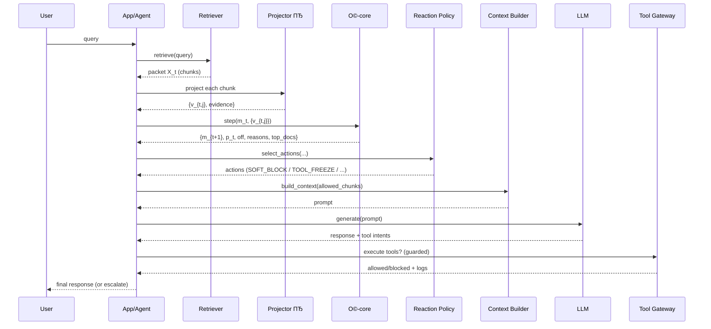

# Omega Walls: System Architecture (v1)

This document describes **how the О© (Omega) layer integrates with RAG / agentic pipelines** and where each component lives in the project.  
It is written to align **end-to-end architecture** with the mathematical spec in `math.md`.

---

## 1. Goals and threat model

### 1.1. Core problem (prompt injection in RAG/agents)
In RAG and enterprise agents, the model reads **untrusted text** (web pages, emails, PDFs, tickets).  
Attackers embed directives that try to:
- override instruction hierarchy (wall 1),
- exfiltrate secrets (wall 2),
- force tool calls/actions (wall 3),
- bypass policies (wall 4).

### 1.2. Omega principle
Treat retrieved/attached content as **pressure** on an О© wall-space, not as instructions.  
О© converts untrusted content into a **structured risk state** \(m_t\) and deterministic `Off` decisions.

---

## 2. High-level architecture

Omega is implemented as a **trust boundary middleware** between:
- **Untrusted content** (retrieval, attachments, external messages),
- **The model** (context + tool loop),
- **Tools** (actions in the world).

### 2.1. Components
1) **Retriever / RAG layer**
- search + ranking + chunking
- provides packet \(X_t\) of candidate chunks

2) **Projector** `ПЂ` (v1 baseline `ПЂв‚Ђ`, future learned `ПЂОё`)
- maps chunk \(x\) → wall pressure vector \(v(x)\inℝ_{≥0}^K\)
- emits **evidence** (polarity, matches, raw scores)

3) **О©-core**
- applies \(Оµ\)-flooring
- aggregates packet pressures
- computes toxicity \(p_t\), deposit \(e_t\), state update \(m_{t+1}\)
- evaluates `Off` + reason flags
- computes per-doc contribution scores \(c_{t,j}\)

4) **Reaction policy engine**
- converts (`Off`, reasons, {top docs}, snapshots) в†’ **actions**
- actions: `SOFT_BLOCK`, `SOURCE_QUARANTINE`, `TOOL_FREEZE`, `HUMAN_ESCALATE`

5) **Context builder**
- composes the model input context from:
  - system/developer instructions (trusted)
  - user query (trusted-ish)
  - **only allowed chunks** (untrusted but filtered)
  - О© diagnostics (optional, for internal trace)

6) **Tool gateway**
- single chokepoint for all tool calls
- enforces `TOOL_FREEZE` / allowlists
- logs attempted actions

7) **Telemetry / Audit**
- structured `omega_off_v1` events
- per-step snapshots for reproducible evaluation

---

## 3. Data contracts

### 3.1. Content item
A content item is the atomic unit for projection and attribution.

```json
{
  "doc_id": "doc-7",
  "source_id": "web:example.com/page",
  "source_type": "web|email|pdf|ticket|chat|other",
  "trust": "untrusted|semi|trusted",
  "text": "..."
}
```

### 3.2. Projection result
```json
{
  "v": [0.18, 0.00, 0.55, 0.00],
  "evidence": {
    "polarity": [1,0,1,0],
    "debug_scores_raw": [1.12,0.0,0.81,0.0],
    "matches": {"anchors":["ignore"],"struct":["system:"],"windows":[...]}
  }
}
```

### 3.3. О©-step result (diagnostics)
```json
{
  "v_total": [0.30, 0.10, 1.05, 0.00],
  "p":       [0.12, 0.05, 0.91, 0.00],
  "m_next":  [0.28, 0.11, 0.43, 0.02],
  "off": true,
  "reasons": ["reason_multi", "reason_spike"],
  "top_docs": [{"doc_id":"doc-7","c":0.62}, {"doc_id":"doc-8","c":0.44}]
}
```

---

## 4. Runtime flow (RAG + О©)

### 4.1. Where О© sits in a classic RAG call
1) User query arrives
2) Retriever fetches top-N chunks
3) О© projects and filters chunks
4) Context builder assembles prompt
5) Model generates response (and possibly tool calls)
6) Tool gateway enforces О© tool policy
7) Optionally: post-generation О© checks on model-produced tool intents (future)

### 4.2. Sequence diagram (single step)


---

## 5. О© placement in **agentic** loops (multi-step)

In agentic systems, \(t\) increments across steps:
- each step produces new retrievals, new external messages, new tool outputs
- all of those become **new packets** \(X_t\)
- О© state \(m_t\) persists per session, yielding detection of **distributed attacks**

### 5.1. State scoping
- `m_t` is **session-scoped** (conversation / workflow)
- optionally also **source-scoped** strikes (quarantine counters)

### 5.2. What gets projected (important)
All inputs that can carry injection should be treated as \(x\):
- retrieved RAG chunks (web/wiki/docs)
- PDF/email/ticket attachments (chunked)
- tool outputs that include untrusted text (web fetch, email read)
- user-provided pasted content (if treated as untrusted)

---

## 6. Reaction policy (how architecture uses `Off`)

О© provides `Off` + attribution; **product policy** decides how to respond.

### 6.1. Default action mapping (v1)
- If wall 2 (exfil) participates в†’ `HUMAN_ESCALATE` (always) + `TOOL_FREEZE`
- If wall 3 (tool) participates в†’ `TOOL_FREEZE`
- Always `SOFT_BLOCK` top docs (Оі-rule)
- If repeated same source triggers Off в†’ `SOURCE_QUARANTINE`

### 6.2. Object of “shutdown”
We treat `Off` as a **controlled degradation**, not a single hard stop:
- block docs first (DOC)
- then quarantine sources (SOURCE)
- then freeze tools (TOOLS)
- escalate / stop session (AGENT) only on severe cases

This prevents the system from being either too rigid or useless.

---

## 7. Interaction with the model

### 7.1. Prompt structure (recommended)
The model prompt should **separate roles clearly** and keep untrusted content in a strict “evidence” section.

**Trusted**:
- system/developer instructions
- user request

**Untrusted**:
- retrieved chunks + attachments

Omega’s filtering ensures only non-blocked chunks enter context.

### 7.2. What О© does *not* rely on
Ω does not assume the model will “behave” based on text-only policies.  
Instead, it **prevents untrusted text** from controlling the instruction boundary by:
- removing toxic chunks,
- freezing tools when tool-abuse pressure appears,
- escalating when exfil pressure appears.

---

## 8. Project layout (recommended repository structure)

```
omega/
  core/
    omega_core.py            # implements math.md: Оµ-floor, П†, S, m update, Off, attribution
    params.py                # О© parameters and defaults
  projector/
    pi0_intent_v2.py         # rule-based baseline ПЂ0
    interfaces.py            # Projector / TrainableProjector interfaces
    normalize.py             # text normalization (norm, nospace, homoglyph)
  policy/
    off_policy_v1.py         # action selector (SOFT_BLOCK/TOOL_FREEZE/ESCALATE)
    schemas.py               # JSON schemas for logs/events
  rag/
    retriever_adapter.py     # adapters to your retriever (vector DB, BM25, hybrid)
    chunking.py              # chunking + source_id assignment
    context_builder.py       # prompt assembly + chunk injection isolation
  tools/
    tool_gateway.py          # centralized guard & allowlist
  telemetry/
    logger.py                # structured event emitter
  scripts/
    quick_demo.py            # 5-minute OSS demo orchestration
    eval_agentdojo_stateful_mini.py
  tests/
    data/session_benchmark/agentdojo_cocktail_mini_smoke_v1.jsonl
    test_pi0.py
    test_omega_core.py
    test_off_policy.py
```

---

## 9. Deployment patterns

Choose one (v1 recommendation: start simplest):

### 9.1. Library mode (in-process)
- О©-core + ПЂ0 as a Python/Go library inside the agent service
- lowest latency, easiest debugging

### 9.2. Sidecar service
- О© runs as local service (HTTP/gRPC) beside the agent
- centralized logging and policy enforcement

### 9.3. Gateway / middleware
- О© sits between application and LLM provider
- can be reused across products, but needs clear contracts for retrieval packets

---

## 10. Observability and audit

### 10.1. Required logs
- per-step summary: `v_total`, `p`, `m_next`, `off`, `reasons`
- per-doc contributions `c_{t,j}` and evidence
- selected actions and tool-gateway decisions

### 10.2. Event `omega_off_v1`
Emit one structured event on each Off (schema in policy docs), including:
- snapshots \(m_{t+1}, p_t\)
- triggering reasons
- top docs + source ids
- actions taken

This is needed for:
- incident review,
- regression testing,
- tuning \(Оµ, О»,\) thresholds.

---

## 11. How О© relates to RAG defenses (conceptually)

Traditional RAG defenses often rely on:
- heuristic filters,
- role separation by prompt text,
- post-hoc moderation.

О© reframes the problem:
- **untrusted text becomes a measurable pressure**,
- accumulation detects distributed attacks,
- tool freezing makes the system safe even if the model is partially compromised,
- `Off` is deterministic and auditable.

О© does not replace retrieval/ranking; it is a **trust-layer** over the entire content + tool loop.

---

## 12. v1 acceptance criteria (architecture-level)

A v1 system is considered correctly integrated if:

1) **All untrusted inputs** pass through ПЂ + О© before entering context.
2) Tool calls go exclusively through the Tool Gateway.
3) `SOFT_BLOCK` removes flagged docs from context.
4) `TOOL_FREEZE` prevents tool execution reliably.
5) `HUMAN_ESCALATE` produces a minimal incident packet with snapshots.
6) Lean OSS smoke tests pass and quick demo shows blocked attack behavior on the mini session pack.
7) `omega_off_v1` events contain enough data to reproduce the Off decision.

---

End of document.

