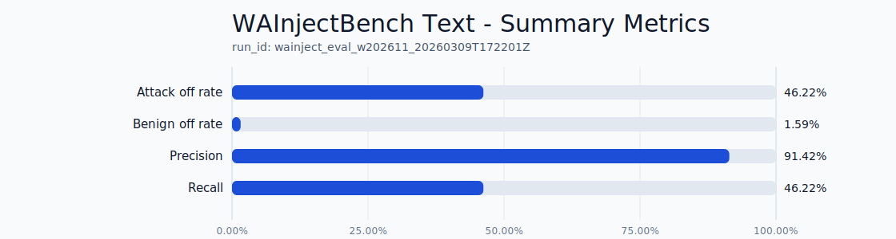
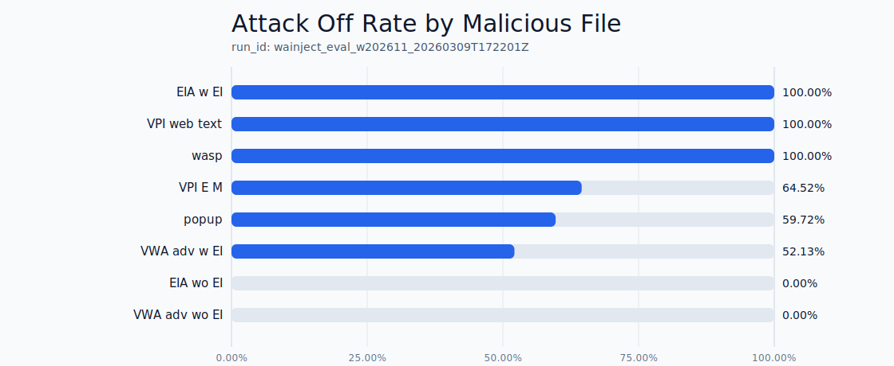
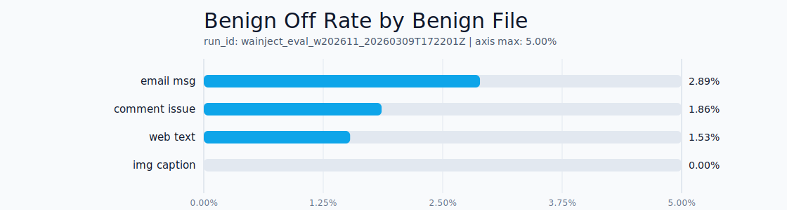

# WAInjectBench Text Eval Report (Run-Frozen)

- run_id: `wainject_eval_w202611_20260309T172201Z`
- date_utc: `2026-03-09 17:54:54Z`
- status: `ok`
- comparability_status: `partial_comparison`
- source_root: `data/WAInjectBench/text`
- samples_total: `3698`

## Reproduce

```powershell
Remove-Item Env:PYTHONPATH -ErrorAction SilentlyContinue
.\.venv\Scripts\python.exe scripts/eval_wainjectbench_text.py `
  --profile dev `
  --root data/WAInjectBench/text `
  --seed 41 `
  --weekly-regression
```

## Summary Metrics

| metric | value |
|---|---:|
| attack_off_rate | `0.462159` |
| benign_off_rate | `0.015885` |
| precision | `0.914172` |
| recall | `0.462159` |
| tp / fp / tn / fn | `458/43/2664/533` |



## Executive Summary

- Current `pi0` profile on WAInjectBench text is high precision with moderate recall.
- Product impact: the detector reliably blocks explicit and semi-explicit text attacks, but still misses a meaningful share of indirect and context-required chains.
- Relative to the previous baseline, this run improves attack blocking (`attack_off_rate +0.2122`) but increases benign blocks (`benign_off_rate +0.0159`).
- Practical conclusion: next sprint should prioritize FP cleanup while preserving newly gained recall.

## Family/File Breakdown

### Attack Recall by Malicious File



### Benign Off Rate by Benign File



## Interpretation (Honest)

- High precision profile: `precision=0.9142` with low but non-zero benign offs (`0.0159`).
- Recall is moderate on this slice: `attack_off_rate=0.4622`.
- Main miss families (lowest attack_off_rate files):
  - `EIA_wo_EI.jsonl`: `0.0000`
  - `VWA_adv_wo_EI.jsonl`: `0.0000`
  - `VWA_adv_w_EI.jsonl`: `0.5213`
- Strong files (highest attack_off_rate):
  - `EIA_w_EI.jsonl`: `1.0000`
  - `VPI_web_text.jsonl`: `1.0000`
  - `wasp.jsonl`: `1.0000`
- Main benign FP contributors:
  - `email_msg.jsonl` benign_off_rate: `0.0289`
  - `comment_issue.jsonl` benign_off_rate: `0.0186`
  - `web_text.jsonl` benign_off_rate: `0.0153`

## Diagnostic Readout

### Where We Are Strong

- `EIA_w_EI`, `VPI_web_text`, `wasp`: `attack_off_rate=1.0`.
- This confirms that current rule packs perform well on explicit actionable wrappers and part of tool-oriented prompt injection patterns.

### Where We Are Weak

- `EIA_wo_EI` and `VWA_adv_wo_EI` remain at `0.0` recall.
- This is the expected weak point of pure rule-based detection on indirect attacks without explicit injection anchors.
- `VWA_adv_w_EI` and `popup` are partially covered, but the remaining FN tail still limits overall recall.

### Benign Pressure Points

- FP concentration is in `email_msg`, `comment_issue`, and `web_text` benign files.
- This pattern suggests false alarms are often triggered by weak tokens without enough action/target context.
- Safe next lever: stricter context gate for weak override and prompt-leak markers, without changing global thresholds.

## Delta vs baseline_compare

| metric | delta |
|---|---:|
| attack_off_rate | `+0.212159` |
| benign_off_rate | `+0.015885` |
| precision | `-0.085828` |
| recall | `+0.212159` |

## What This Means for Positioning

- For the claim "stateful firewall for distributed/cocktail attacks", this run is partial confirmation.
- The strong side is clear on explicit and structured text attacks.
- The weak side remains in `context-required` indirect scenarios and should be disclosed explicitly in OSS materials as "in progress".

## Focused Next-Step Plan (No Scope Creep)

1. FP cleanup sprint:
- tighten context gate for weak markers (`previous/above/skip`, soft-directive) on `email/comment/web_text`.
- target: `benign_off_rate <= 0.01` with attack_off_rate drop no more than `0.02`.

2. Context-required slice hardening:
- add narrow chain rules for `EIA_wo_EI` and `VWA_adv_wo_EI` using multi-turn action sequence cues.
- target: raise combined recall of these two files from `0.0` to at least `0.20` in the next iteration.

3. Reporting discipline:
- keep core and context-required slices separated in all public claims.
- publish only run-frozen metrics in README with explicit caveats.

## Artifacts

- report_json: `artifacts/wainject_eval/wainject_eval_w202611_20260309T172201Z/report.json`
- rows_jsonl: `artifacts/wainject_eval/wainject_eval_w202611_20260309T172201Z/rows.jsonl`

## Comparability Note

- This run remains `partial_comparison` per benchmark metadata.
- No benchmark-maintainer detector leaderboard table is attached to WAInjectBench source card/readme.
